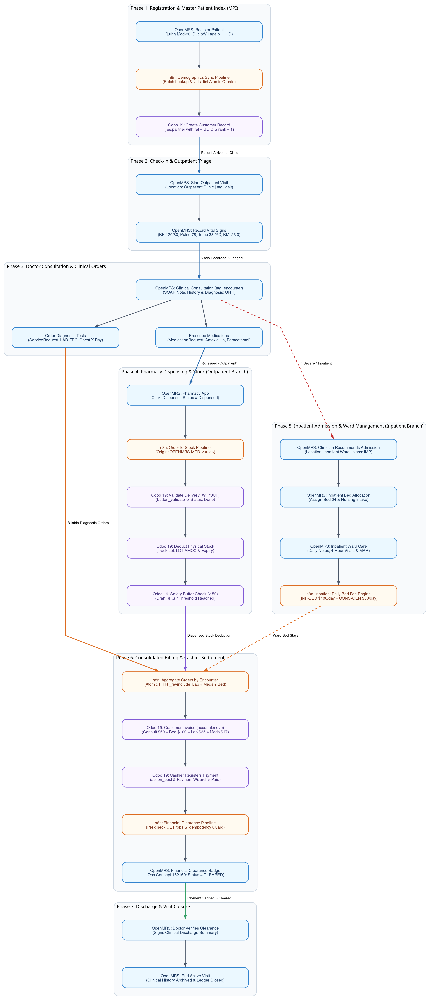

# OpenMRS 3 ↔ n8n ↔ Odoo 19 Clinical Integration Ecosystem

[](https://openmrs.org/)
[](https://www.odoo.com/)
[](https://n8n.io/)
[](#prerequisites)

A turnkey, production-ready enterprise healthcare ecosystem integrating **OpenMRS 3** (Electronic Medical Records), **Odoo 19** (ERP, Billing, Accounting, & Warehouse Stock Management), and **n8n** (Event Orchestration & Workflow Automation).

---

## Architecture Overview

```
                      +---------------------------------------+
                      |       OpenMRS 3 RefApp (SPA)          |
                      |   Clinical Encounters, Orders & Rx    |
                      +-------------------+-------------------+
                                          |
                        FHIR R4 / REST v1 | HTTP Polling / Webhooks
                                          v
                      +-------------------+-------------------+
                      |         n8n Integration Engine        |
                      |   Payload Normalization & Orchestration|
                      +-------------------+-------------------+
                                          |
                      JSON-2 External API | Bearer Token Auth
                                          v
                      +-------------------+-------------------+
                      |             Odoo 19 ERP               |
                      | Customers, Sales Orders, Invoices,    |
                      | Payments & Batch-Tracked Stock Pickings|
                      +---------------------------------------+
```

### Key Integration Workflows

1. **Master Patient Index (MPI) Synchronization**:
   - Automatically polls or receives OpenMRS FHIR R4 Patient resources.
   - Batch-matches existing customers in Odoo via `ref` (`patient_uuid`).
   - Creates or updates `res.partner` records with complete demographics, addresses, and phone numbers.

2. **Order-to-Billing & Real-Time Stock Clearance**:
   - Aggregates clinical orders (Lab tests, Consultation fees, Pharmacy medications) per encounter.
   - Maps OpenMRS Drug & Concept UUIDs to Odoo `product.product` internal references.
   - Generates Odoo `sale.order` quotations and confirms them into draft customer invoices (`account.move`).
   - Verifies on-hand stock and lot numbers for pharmaceutical items and prepares warehouse delivery orders (`stock.picking`).
   - Writes back financial clearance status to OpenMRS once invoices are settled by cashiers.

---

## Patient Lifecycle Flowchart

The complete 7-phase patient journey across clinical consultation, lab diagnostics, pharmacy dispensation, Odoo invoicing, cashier payment, stock deduction, and patient clearance is illustrated below:



> Detailed step-by-step Standard Operating Procedures are documented in [docs/sop_patient_lifecycle_openmrs_odoo.md](docs/sop_patient_lifecycle_openmrs_odoo.md).

---

## Quickstart Guide

### Prerequisites

| Component | Minimum Requirement | Notes |
| :--- | :--- | :--- |
| **OS** | Linux (Ubuntu/Debian/Fedora) or Windows 10/11 with WSL2 | Tested on Fedora 40 and Ubuntu WSL2 |
| **Docker Engine** | Docker 24.0+ & Docker Compose v2 | Included in Docker Desktop on Windows |
| **Memory** | 8 GB RAM (12 GB+ recommended) | OpenMRS Java backend requires ~2GB |
| **Python** | Python 3.9+ with `requests` | For automated test scripts & seeding |

---

### Windows (WSL2 + Docker Desktop) Setup

> [!IMPORTANT]
> **CRITICAL: Clone inside the native WSL2 filesystem (`~/`), NOT inside `/mnt/c/`!**
> Bind mounts for PostgreSQL and MariaDB containers will fail or suffer severe performance degradation if placed inside Windows NTFS (`/mnt/c/...`). Always run inside the Linux virtual disk.

1. **Install WSL2 & Docker Desktop** (if not already installed):
   - Open PowerShell as Administrator and run:
     ```powershell
     wsl --install -d Ubuntu
     ```
   - In Docker Desktop Settings: **General** ➔ Enable *Use the WSL 2 based engine*.
   - In Docker Desktop Settings: **Resources** ➔ **WSL Integration** ➔ Turn ON integration for your Ubuntu distribution.

2. **Open your WSL2 terminal** and navigate to your home directory:
   ```bash
   cd ~
   ```

3. **Clone the repository**:
   ```bash
   git clone https://github.com/michaelnyirenda/openmrs-odoo-n8n.git
   cd openmrs-odoo-n8n
   ```

4. **Run the 1-click bootstrap script**:
   ```bash
   ./bootstrap.sh
   ```

---

### Linux (Fedora / Ubuntu / Debian) Setup

1. **Clone the repository**:
   ```bash
   git clone https://github.com/michaelnyirenda/openmrs-odoo-n8n.git
   cd openmrs-odoo-n8n
   ```

2. **Run the 1-click bootstrap script**:
   ```bash
   ./bootstrap.sh
   ```

---

## What `bootstrap.sh` Does Automatically

The automated bootstrap script orchestrates the entire stack from zero to fully operational:

1. **Pre-flight Checks**: Verifies Docker, Compose, Python 3, and ensures you are not running from an NTFS mount.
2. **Directory & Permissions**: Creates persistent volume folders (`odoo-db-data`, `openmrs-db-data`, etc.) with correct container permissions.
3. **Environment**: Copies `.env.example` to `.env` if missing.
4. **Service Startup**: Launches all 6 Docker containers (`odoo19`, `odoo-db`, `openmrs-backend`, `openmrs-frontend`, `openmrs-gateway`, `openmrs-db`, `n8n-engine`).
5. **Health Verification**: Polls all service ports until OpenMRS, Odoo, and n8n are ready.
6. **Odoo Database Initialization**: Creates `clinic_db` and installs core modules (`sale`, `purchase`, `account`, `stock`) headless without sample demo junk.
7. **Odoo API Key Setup**: Sets up the persistent external JSON-2 API key for n8n integration.
8. **n8n Workflow Auto-Import**: Imports n8n credentials and activates the synchronization workflows.
9. **Clinical Ecosystem Seeding**: Runs `seed_clinical_ecosystem.py` to seed hospital products (Amoxicillin, Paracetamol, Blood Tests, Consultation fees), lot tracking, and 3 realistic patient journeys.

---

## Service Endpoints & Default Credentials

| Service | URL | Username | Password / Token | Database |
| :--- | :--- | :--- | :--- | :--- |
| **OpenMRS 3 Frontend (SPA)** | [http://localhost:8080/openmrs/spa](http://localhost:8080/openmrs/spa) | `admin` | `Admin123` | `openmrs` (MariaDB) |
| **OpenMRS REST / FHIR API** | `http://localhost:8080/openmrs/ws/fhir2/R4` | `admin` | `Admin123` | - |
| **Odoo 19 ERP Web UI** | [http://localhost:8069](http://localhost:8069) | `admin` | `admin` | `clinic_db` |
| **Odoo 19 External JSON-2 API** | `http://localhost:8069/json/2/<model>/<method>` | - | `1f4624cfdc7ce0fea669677b8ff485ad087f720c` | `clinic_db` |
| **n8n Automation Engine** | [http://localhost:5678](http://localhost:5678) | - | Setup on first web visit or pre-configured | SQLite / embedded |

---

## Repository Structure

```
openmrs-odoo-n8n/
├── .gitattributes             # Enforces Unix LF line endings across Windows & Linux
├── .gitignore                 # Excludes live DB binary volumes (*-data/) & caches
├── .env.example               # Template environment variables and port configurations
├── docker-compose.yml         # Container stack definitions with health networks
├── bootstrap.sh               # Turnkey 1-click installer and service initializer
├── seed_clinical_ecosystem.py # Generates products, stock lots, Luhn Mod-30 patients, & clinical orders
├── verify_ecosystem.py        # End-to-end automated verification & regression test suite
├── odoo-config/
│   └── odoo.conf              # Odoo 19 server configuration
├── workflows/
│   ├── sync_patients_openmrs_odoo.json  # OpenMRS ➔ Odoo demographics sync workflow
│   ├── order_to_billing_and_stock.json  # Order ➔ Odoo Invoicing & Stock deduction workflow
│   └── n8n_credentials.json            # Default credential connections for OpenMRS & Odoo
└── docs/
    ├── sop_patient_lifecycle_openmrs_odoo.md # Standard Operating Procedure v3.0
    ├── patient_lifecycle_flowchart.png       # High-resolution traditional 7-phase flowchart
    ├── patient_lifecycle_flowchart.svg       # Scalable vector diagram
    └── patient_lifecycle_flowchart.dot       # Graphviz DOT source diagram
```

---

## Testing & Verification

### Run the Automated Regression Suite

Once the stack is running, execute the verification suite to test 100% end-to-end functionality across all systems:

```bash
python3 verify_ecosystem.py
```

This script verifies:
1. OpenMRS 3 API availability and session authentication.
2. Odoo 19 JSON-2 API connectivity and `clinic_db` integrity.
3. n8n health and workflow loading.
4. Patient demographics synchronization between OpenMRS and Odoo.
5. Sales quotation creation, pricing calculation, and draft invoicing in Odoo.
6. Stock on-hand levels and batch/lot allocation.
7. Post-payment financial clearance writeback.

---

## Troubleshooting

### 1. Windows WSL2: PostgreSQL / MariaDB fails with `Permission denied`
- **Cause**: You cloned the project onto the Windows C: drive (`/mnt/c/...`).
- **Fix**: Move the directory into native WSL2 Linux filesystem:
  ```bash
  mv /mnt/c/Users/<YourUser>/openmrs-odoo-n8n ~/openmrs-odoo-n8n
  cd ~/openmrs-odoo-n8n
  ./bootstrap.sh
  ```

### 2. Line Ending Errors (`\r`: command not found)
- **Cause**: Windows Git checked out files with `CRLF` endings instead of `LF`.
- **Fix**: The repository includes `.gitattributes` to enforce `LF`. If you modified files on Windows, convert them back:
  ```bash
  git checkout-index --force --all
  # or
  sed -i -e 's/\r$//' bootstrap.sh
  ```

### 3. Port Already in Use (8080, 8069, or 5678)
- Check what is running on the conflicting port:
  ```bash
  sudo lsof -i :8080
  sudo lsof -i :8069
  sudo lsof -i :5678
  ```
- Change the conflicting external port in `.env` or `docker-compose.yml`.

### 4. Fresh Reset / Clean Slate
To wipe all live database data and start with a completely fresh state:
```bash
docker compose down -v
rm -rf odoo-db-data/* odoo-web-data/* openmrs-db-data/* openmrs-data/* n8n-data/*
./bootstrap.sh
```

---

## License & Support
Internal Healthcare Systems Integration Project. Developed for clinical workflow demonstration, testing, and production deployment.
